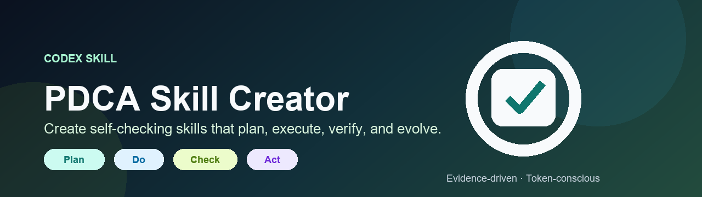
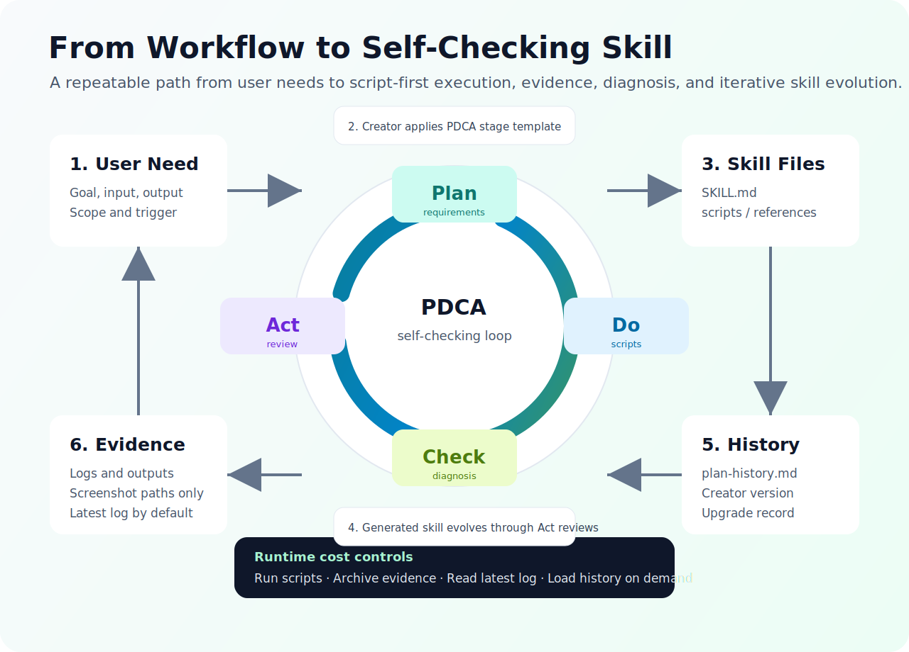

# PDCA Skill Creator

[简体中文](README.zh-CN.md) | English



`pdca-skill-creator` is a Codex skill for creating self-checking, repeatable, and continuously improving skills based on the PDCA loop: Plan, Do, Check, Act.

It helps turn recurring business workflows, inspection tasks, monitoring jobs, reports, crawler workflows, and operational processes into Codex skills with clear execution steps, check rules, evidence, logs, health diagnosis, and review-driven evolution.

## What It Does

`pdca-skill-creator` is a meta-skill. It does not only write a workflow description; it helps transform a recurring process into a durable Codex skill that can execute, check, review, and evolve.

Generated skills are designed around four stages:

- **Plan**: Clarify requirements, define boundaries, design execution steps, and create check rules.
- **Do**: Execute tasks through scripts or deterministic tools, while preserving logs and evidence.
- **Check**: Validate results with explicit rules, diagnose issues, and recommend actions.
- **Act**: Review outcomes, absorb user feedback, and decide whether a new Plan cycle is needed.

## Key Features

- Converts fuzzy business needs into executable skill designs.
- Keeps the business core first, so generated skills implement the minimal real workflow before wrapping it in PDCA, reports, logs, and review structure.
- Requires crawler-style skills to generate a real collection framework with URL handling, Playwright page access, basic DOM extraction, screenshots, error classification, and structured output.
- Includes a required Plan / Do / Check / Act stage template for generated skills.
- Requires every stage to define inputs, actions, outputs, exception handling, and evidence requirements.
- Marks both target maturity and current maturity for generated skills, so workflow descriptions or placeholder scaffolds are not mistaken for deployable systems.
- Generates executable scaffolds, checkers, and smoke-test entry points for automation, inspection, monitoring, reporting, and crawler-style skills.
- Requires a capability matrix that clearly separates implemented, placeholder, and pending capabilities.
- Requires Check scripts to consume rule files, reducing the risk that check rules live only in documentation.
- Requires rule files, output schemas, Do-script outputs, Check-script fields, and deployment contracts to stay consistent.
- Requires crawler-style skills to actually consume `references/selectors.yaml`, not merely generate the file.
- Supports post-generation smoke tests for script syntax, sample execution paths, exit codes, and key artifacts.
- Generates a Codex-installable plugin directory with `.codex-plugin/plugin.json` and `skills/` when the user asks for a plugin.
- Supports structured logs, health diagnosis tables, and P0/P1/P2 priority levels.
- Encourages script-first execution to reduce repeated reasoning and token usage.
- Treats screenshots as archived evidence, not default visual-analysis context.
- Reads only the latest runtime log by default to avoid context bloat.
- Requires `references/plan-history.md` to preserve historical requirements and decisions.
- Preserves creator source, version, and generation date so old skills can be upgraded later.

## Maturity And Evidence-Based Capability Claims

One of the core strengths of `pdca-skill-creator` is that it does not treat "has a workflow", "has scripts", or "has a scheduled entry point" as proof of deployability. Generated skills are expected to separate target maturity, current maturity, and evidence boundaries, so users can see which capabilities are implemented, which are scaffolds, and which still depend on accounts, permissions, selectors, APIs, or real runtime validation.

Generated skills use four maturity levels:

| Level | Meaning | Typical Evidence |
|---|---|---|
| L1 Specification | The workflow, rules, and open questions are documented, but the skill must not claim to be runnable. | PDCA stages, business rules, open questions |
| L2 Rules | Rules, deployment contracts, and output formats exist, but stable execution scripts are missing. | Check rules, output schema, deployment contract |
| L3 Executable | Do/Check scripts, structured outputs, logs, and a local manual entry point exist. | `run_task.py`, `check_outputs.py`, smoke test, runtime logs |
| L4 Deployable | L3 plus a real business execution path, scheduled entry point, failure handling, and deployment acceptance records. | Scheduler entry point, exit codes, log discovery, deployment parameters, acceptance record |

Generated skills also include a capability matrix that explains:

- Whether directory initialization, input validation, real business execution, structured output, and report delivery are implemented.
- Whether Check rules are actually consumed by scripts instead of living only in documentation.
- Whether screenshots, logs, diagnostics, baseline protection, and deployment entries are supported by evidence.
- Whether self-optimization is only a mechanism, has been executed through Do/Check/Act, or has been proven through repeated retests.

This makes generated skills easier to review, accept, and reuse across a team. The README-level promise is intentionally practical: show the automation potential, but keep every claim tied to evidence so placeholder scaffolds are not mistaken for production-ready systems.

## 0.2.4 Postmortem Adjustments: Use Case Tests And Self-Optimization Evidence

Observed failure: creator quality needed a more stable use-case testing loop, and "self-improving" could too easily become a broad claim without evidence boundaries. Version `0.2.4` adjusts the creator rules as follows:

- **Added creator use-case testing loop**: When the user asks for use-case testing, retesting, or creator self-optimization, the creator should complete candidate generation, scoring, reports, Act improvements, and iterative retests as needed, stopping once the passing standard is met.
- **Added default Amazon ASIN inspection use case**: Covers project isolation, daily collection, baseline comparison, anomaly grading, dual-sheet reports, screenshot evidence, and anti-risk tolerance.
- **Added deterministic test script**: `scripts/run_creator_use_case_test.py` can generate machine-readable scores, test reports, and Act improvement lists.
- **Added layered self-optimization evaluation**: Separates "has a self-optimization mechanism", "self-optimization was executed", and "self-evolution was proven", with runtime or retest evidence required for stronger claims.
- **Improved README-level capability messaging**: Presents maturity grading, capability matrices, and evidence chains as product strengths, making generated skills easier to review and accept.

## 0.2.3 Postmortem Adjustments: Installable Plugins And Contract Consistency

Observed failure: a generated business skill could be an L3 scaffold but still have mismatched rule/output fields, selector files that were not actually consumed by scripts, smoke tests that tolerated unexpected failures, zip archives containing runtime caches, and plugin requests that only produced an archive instead of a Codex-installable plugin directory. Version `0.2.3` adjusts the creator rules as follows:

- **Adjusted plugin delivery format**: When the user asks for a plugin, Codex-installable output, or direct installation, the creator must generate a plugin directory with `.codex-plugin/plugin.json` and `skills/`; zip files are only optional transport archives.
- **Adjusted output contract checks**: `check-rules.yaml.required_outputs`, `output-schema.json`, Do-script `outputs`, Check-script fields, and deployment contracts must agree.
- **Adjusted selector consumption requirements**: If `references/selectors.yaml` is generated, the collection script must read and use it.
- **Adjusted smoke-test failure classification**: Empty dry-run business fields can be expected, but field-name mismatches, unread rule files, schema mismatches, and missing artifact paths are unexpected failures.
- **Adjusted clean packaging rules**: Final skill packages and plugin directories must exclude `__pycache__/`, `*.pyc`, `work_smoke/`, temporary logs, and local self-check outputs.

## 0.2.2 Postmortem Adjustments: Business Core First

Observed failure: a generated skill could have a complete PDCA shell while the real business action, such as crawling Amazon pages, remained a placeholder. Version `0.2.2` adjusts the creator rules as follows:

- **Adjusted business-core-first generation**: The creator must identify the core business action first and implement the minimal real loop before adding PDCA wrappers, reports, logs, baselines, and review structure.
- **Adjusted crawler generation gate**: Web crawling and page inspection skills must generate a real collection framework with URL construction or loading, Playwright page access, timeout handling, basic DOM extraction, screenshots, structured output, and error classification.
- **Adjusted selector handling**: Unknown page selectors should become `references/selectors.yaml` or an equivalent configuration file, not a reason to skip page access entirely.
- **Adjusted field extraction requirements**: User-requested fields must be mapped to extraction strategies, selectors or fallbacks, evidence paths, and open questions.
- **Adjusted maturity downgrade**: If no real collection framework is generated, current maturity is capped at L2. If the framework exists but selectors are still pending, current maturity is capped at an executable L3 scaffold.
- **Adjusted delivery order**: If the business core remains a placeholder, the final delivery must surface that gap before describing the PDCA shell.

## 0.2.1 Postmortem Adjustments: Post-Generation Test And Check Loop

Observed failure: generated skills were too easily judged by whether scripts existed, not by whether those scripts actually supported the claimed maturity level. Version `0.2.1` adjusted the creator rules as follows:

- **Adjusted maturity grading**: Separates target maturity from current maturity. If core business logic is still `stub`, `TODO`, `not_configured`, `dry-run only`, or placeholder output, the skill must not claim L4 deployability.
- **Adjusted capability boundary reporting**: Requires generated skills to report status for directory initialization, input validation, real business execution, structured output, report delivery, Check execution, evidence/logging, and deployment entry points.
- **Adjusted checker generation**: Requires L3/L4 Check scripts to read `references/check-rules.yaml`, `references/output-schema.json`, or equivalent rule files instead of leaving rules only in documentation.
- **Adjusted post-generation testing**: Requires generating or running `scripts/smoke_test.py` to validate syntax, minimal sample flows, exit codes, and key artifacts.
- **Adjusted downgrade explanations**: If accounts, permissions, browser access, network, selectors, API keys, or external data are missing, the skill must explain why self-checking was not completed and downgrade current maturity to the level supported by evidence.

## Use Cases

Use this skill when you want to create or upgrade a Codex skill for:

- Recurring business operations.
- Website, marketplace page, product page, or admin-page inspections.
- E-commerce listing, ASIN, price, inventory, image, or content quality checks.
- Daily, weekly, operational, or business analysis reports.
- Spreadsheet exports, business metrics, and anomaly checks.
- Web crawling, DOM extraction, screenshot archiving, and evidence workflows.
- Internal standard operating procedures that need to become reusable skills.
- Existing skills that need better review loops, check rules, or runtime-cost controls.

## Workflow



## Who It Is For

- Operations, product, growth, and data teams that want to turn repeated work into Codex skills.
- Teams that want AI workflows to include logs, evidence, check rules, and review loops.
- Skill creators who want to avoid re-explaining requirements every time.
- Teams that need requirement history and decision records across multiple iterations.

## Repository Structure

```text
pdca-skill-creator/
├── SKILL.md
├── agents/
│   └── openai.yaml
└── references/
    └── pdca-stage-template.md
```

- `SKILL.md`: Main skill entry point, trigger description, creation workflow, and mandatory rules.
- `agents/openai.yaml`: Codex UI metadata, including display name, short description, and default prompt.
- `references/pdca-stage-template.md`: Detailed PDCA stage template loaded when creating business skills.

## Installation

The simplest way is to add this repository as a Codex plugin marketplace.

## Publication Metadata

- Plugin name: `pdca-skill-creator`
- Marketplace: `ai-plan-go`
- Published repository: <https://github.com/ai-plan-go/plugins>
- Git URL: `https://github.com/ai-plan-go/plugins.git`
- Current version: `0.2.4`

Future sessions should use this section, `marketplace.json`, and `plugins/pdca-skill-creator/.codex-plugin/plugin.json` to quickly identify the published plugin.

### Install from Codex

1. Open Codex.
2. Go to **Plugins**.
3. Choose **Add plugin marketplace**.


4. Enter this GitHub URL:

```text
https://github.com/ai-plan-go/plugins.git
```

5. Install **PDCA Skill Creator** from the marketplace.

### Manual Fallback

If marketplace installation is not available in your Codex build, copy the skill folder manually:

```bash
git clone https://github.com/ai-plan-go/plugins.git
mkdir -p ~/.codex/skills
cp -R plugins/pdca-skill-creator/skills/pdca-skill-creator ~/.codex/skills/
```

### Verify Installation

After restarting or refreshing Codex, try:

```text
Use $pdca-skill-creator to create a skill for a recurring workflow.
```

If the skill is loaded correctly, Codex should use the PDCA workflow and ask for the business goal, inputs, outputs, check rules, and review requirements.

## Usage

After installing or enabling the skill in Codex, use prompts like:

```text
Use $pdca-skill-creator to create a skill for daily Amazon listing checks.
```

The creator will help confirm:

- The business goal.
- Required input data.
- Who consumes the output.
- Success and failure criteria.
- Exceptions that must be diagnosed.
- Whether scripts, logs, screenshots, reports, or historical records are needed.
- How future Act-stage reviews should improve the skill.

## Generated Skill Guarantees

Skills created with `pdca-skill-creator` are designed to include:

- A clear PDCA operating model.
- Explicit inputs, actions, outputs, exception handling, and evidence requirements.
- Script-first execution for repeatable tasks.
- Structured logs and check results.
- Health diagnosis with P0/P1/P2 priority levels.
- Token-control rules for scripts, screenshots, and historical logs.
- A `references/plan-history.md` file for preserving historical requirements and decisions.
- Source metadata that records the creator name, repository, version, and generation date.

## Design Philosophy

The goal is not to make AI think harder every time. The goal is to make repeatable work more structured:

- Scripts execute the stable parts.
- Rules check the results.
- Logs and evidence make conclusions reviewable.
- Act-stage reviews preserve learning.
- Historical Plan records prevent requirement drift.

## Version

Current creator version: `0.2.4`

Source repository: <https://github.com/ai-plan-go/plugins.git>

