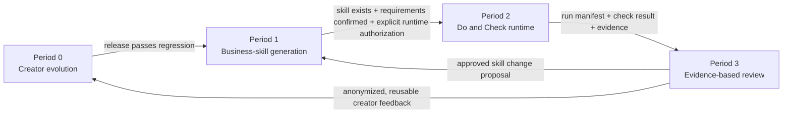
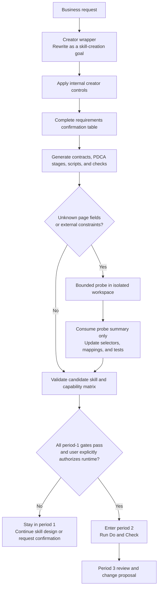
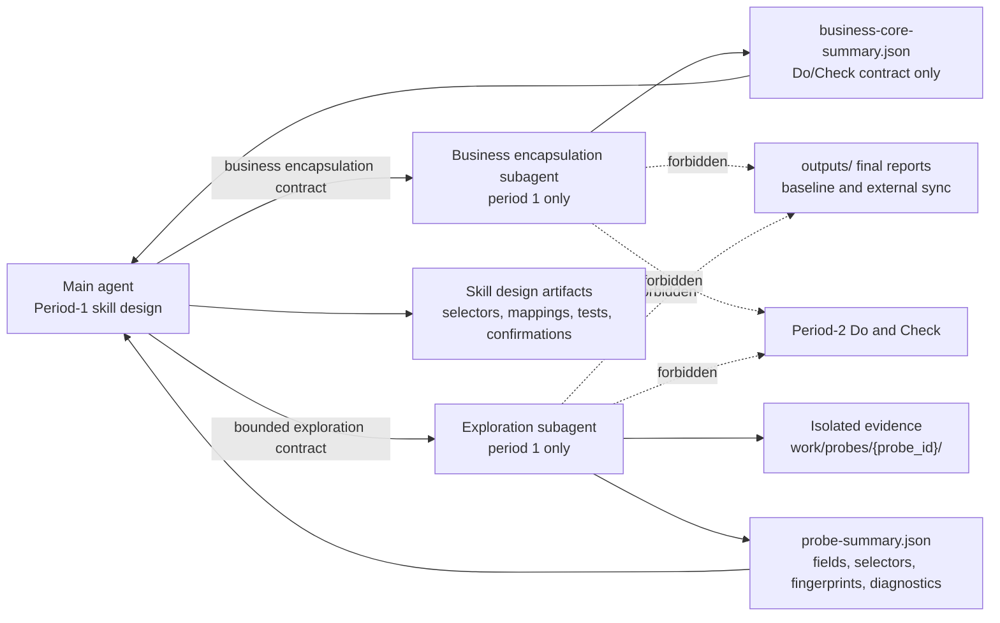
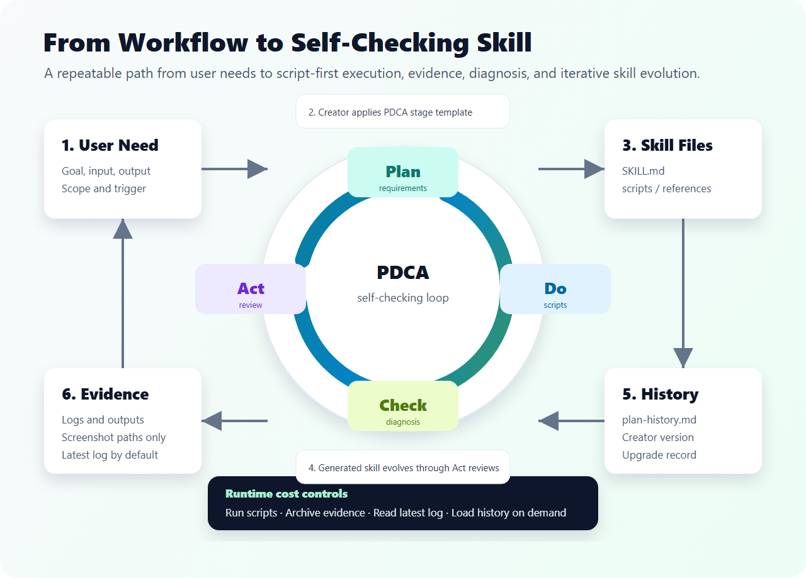

# PDCA Skill Creator

[简体中文](README.zh-CN.md) | English


`pdca-skill-creator` is a Codex skill for creating self-checking, repeatable, and continuously improving skills based on the PDCA loop: Plan, Do, Check, Act.

It helps turn recurring business workflows, inspection tasks, monitoring jobs, reports, crawler workflows, and operational processes into Codex skills with clear execution steps, check rules, evidence, logs, health diagnosis, and review-driven evolution.

## What It Does

`pdca-skill-creator` is a meta-skill. It does not only write a workflow description; it helps transform a recurring process into a durable Codex skill that can execute, check, review, and evolve.

Generated skills are designed around four stages:

- **Plan**: Clarify requirements, define boundaries, design execution steps, and create check rules.
- **Do**: Execute tasks through scripts or deterministic tools, while preserving logs and evidence.
- **Check**: Validate results with explicit rules, diagnose issues, and recommend actions.
- **Act**: Review outcomes, absorb user feedback, and decide whether a new Plan cycle is needed.

## Core Capabilities

### Business-First Skill Design

- Converts fuzzy business goals into concrete inputs, outputs, rules, and operating boundaries.
- Identifies the business core first, then adds PDCA, reports, logs, baselines, and review structure around it.
- For crawler and page-inspection work, requires a real collection path: URL handling, Playwright access, DOM extraction, screenshots, structured results, and error classification.
- Uses selector configuration such as `references/selectors.yaml` when page selectors are unknown, and requires scripts to actually consume that configuration.

### PDCA Execution Scaffold

- Generates business-specific Plan, Do, Check, and Act stages with inputs, actions, outputs, exception handling, evidence, and confirmation points.
- Requires a step-by-step confirmation table before creating automation, crawler, inspection, report, or scheduled skills.
- Creates executable scaffolds for automation, monitoring, reporting, crawler, and recurring operations.
- Uses script-first execution with `init_project.py`, `run_task.py`, `check_outputs.py`, `smoke_test.py`, and scheduled entry points when needed.
- Requires `references/do-run-plan.md` for L3/L4 executable skills so the Do script flow is understandable without reading source code.
- Keeps screenshots, logs, and structured files as evidence rather than relying on repeated AI-only reasoning.

### Evidence-Based Maturity

- Separates target maturity from current maturity so scaffolds are not mistaken for production-ready systems.
- Produces capability and business-core implementation matrices that mark each capability as implemented, placeholder, or pending.
- Requires Check scripts to consume rule files and output schemas.
- Keeps rule files, schemas, Do outputs, Check fields, and deployment contracts aligned.

Generated skills use four maturity levels:

| Level | Meaning | Typical Evidence |
|---|---|---|
| L1 Specification | Workflow, rules, and open questions are documented, but the skill must not claim to be runnable. | PDCA stages, business rules, open questions |
| L2 Rules | Rules, deployment contracts, and output formats exist, but stable execution scripts are missing. | Check rules, output schema, deployment contract |
| L3 Executable | Do/Check scripts, structured outputs, logs, and a local manual entry point exist. | `run_task.py`, `check_outputs.py`, smoke test, runtime logs |
| L4 Deployable | L3 plus a real business execution path, scheduled entry point, failure handling, and deployment acceptance records. | Scheduler entry point, exit codes, log discovery, deployment parameters, acceptance record |

### Quality Gates And Scoring

- Keeps `scripts/run_creator_use_case_test.py` for creator regression testing with the default Amazon ASIN use case.
- Adds a ShowStart post-rock regression case for install verification, runtime selection, field quality, classification evidence, and network diagnostics.
- Adds a generic generated-skill quality gate through `scripts/run_generated_skill_quality_gate.py`.
- Requires newly generated skills to include `scripts/score_skill_quality.py` and `references/skill-quality-rubric.json` for business-neutral PDCA quality scoring.
- Requires newly generated skills to include `scripts/run_business_use_case_test.py` and `references/business-use-case-profile.json` for scenario-specific scoring.
- Uses a default passing line of 85/100 with no P0/P1 blockers.

### Self-Optimization And Retesting

- Separates self-optimization mechanism, executable self-optimization, and proven self-evolution.
- Requires Act outputs to name retest entries and evidence paths.
- Marks untested optimization claims as pending or not verified instead of implying success.
- Preserves requirement history and decisions in `references/plan-history.md`.

### Plugin Delivery And Clean Packaging

- Generates a Codex-installable plugin directory with `.codex-plugin/plugin.json` and `skills/` when plugin delivery is requested.
- Requires install, reinstall, installed-cache synchronization, structure checks, and one post-install dry run to be documented and verifiable.
- Requires Windows scheduler entry points to accept an explicit Python runtime instead of assuming bare `python`.
- Requires crawler and classifier smoke tests to validate expected sample fields and business classification results.
- Classifies collection failures such as network permission, timeout, HTTP, login or captcha, selector, and proxy errors with rerun guidance.
- Treats zip files as optional transport archives, not as a replacement for installable plugin structure.
- Excludes `__pycache__/`, `*.pyc`, `work_smoke/`, `tmp_smoke/`, business test reports, temporary logs, and local test outputs from final deliverables.
- Supports testing either plain skill folders or installable plugin roots.

## Fixed Creator Flow

Every new or upgraded skill follows the same named sequence:

1. **Step 1 - Requirements Check and Confirmation**: record the business goal, source, scope, fields, output, environment, quality rules, and delivery form.
2. **Step 2 - Creator Wrapper**: turn the business request into a skill-creation goal; do not treat it as an instruction to run the business task.
3. **Step 3 - Business-Core Convergence**: define the smallest real business action before adding reports, logs, PDCA structure, or plugin packaging.
4. **Step 4 - Probe or Business Encapsulation**: use a bounded probe or subagent only for unresolved fields, page constraints, or business contracts.
5. **Step 5 - Skill Structure Generation**: create the skill or installable plugin layout.
6. **Step 6 - Contracts and Scripts**: add the execution plan, script design, AI decision checklist, rules, schemas, and runnable scaffold.
7. **Step 7 - Quality Gates and Self-Check**: reject missing confirmation, a missing business core, leaked creator controls, or unverified runtime claims.
8. **Step 8 - Release and Delivery**: validate metadata, package structure, and clean delivery contents.

Two gates are deliberately strict: requirement confirmation happens before implementation or probing, and a confirmed design is not permission to perform a real Do/Check run. The creator's internal `active_period` state is never a field that users of a generated business skill need to understand.

## Creator Internal Controls

This section is a maintainer-facing map of the creator's internal controls. `SKILL.md` and the referenced contracts remain authoritative. Generated business skills use preparation, runtime, and review language instead of exposing `active_period` or period numbers.

### Four-Period Lifecycle



| Period | Subject and permitted work | Required evidence | Hard boundary | Exit condition |
|---|---|---|---|---|
| 0 | Improve the creator itself: rules, templates, gates, regression cases, version, and release package. | Change record, regression result, release synchronization. | Do not create or invent business runtime data. | Creator regression passes and release files are synchronized. |
| 1 | Create or upgrade a business skill: clarify requirements, define contracts, generate scaffolding, and establish tests. | Creator wrapper, confirmation table, lifecycle contract, capability matrix. | Do not claim a final business result or enter live Do/Check. | Skill exists, all P0/P1 confirmations are resolved, and the user explicitly authorizes runtime. |
| 2 | Run an existing skill's Do and Check stages in a dedicated run directory. | `run-manifest.json`, logs, structured result, Check result, evidence paths, exit code. | Do not modify skill source, rules, or baselines while running. | A complete run record is available for review. |
| 3 | Review one identified run and form a change proposal. | Run evidence, diagnosis, proposal, impact analysis, and retest plan. | Do not silently implement or publish a proposed change. | The user approves a return to period 1, or the proposal is retained as feedback. |

### Main Flow And Gate Sequence



During skill creation, the words “start,” “continue,” or “execute” mean continue building the skill unless the user explicitly authorizes a real runtime action such as running Do/Check or starting formal collection.

### Control Checklist Crosswalk

| Control point | Period | What must be checked | Evidence or artifact | Failure response |
|---|---:|---|---|---|
| Creator wrapper | 1 | Business request is expressed as a reusable skill capability, not an immediate business command. | Wrapper result with original goal, skill goal, prohibited direct actions, and allowed sample boundary. | Stop before search, collection, script execution, or final report generation. |
| Requirements confirmation | 1 | Data source, output format, trigger, parameters, permissions, and delivery form are known or marked pending. | Complete confirmation table with status, risk, and handling action. | Keep the candidate in design mode; do not imply deployment readiness. |
| Stage gate | 1 -> 2 | Skill source exists, no P0/P1 confirmation remains, and the user clearly authorizes live runtime. | Lifecycle contract and explicit user authorization. | Stay in period 1 even if a sample page was accessible. |
| Do design | 1 | Business core has a real execution path before reports and process wrappers. | `do-run-plan.md`, `script-design.md`, AI decision checklist, script inventory. | Downgrade maturity or record the implementation gap. |
| Runtime provenance | 2 | Each business result can be traced to source, script version, steps, record counts, evidence, and exit code. | `run-manifest.json` or equivalent. | Mark result unverified; block baseline updates, synchronization, and business conclusions. |
| Check enforcement | 2 | Check scripts consume rules and schemas, verify required outputs, and classify failures. | Machine-readable Check result, rules, schema, exit code. | Produce P0/P1/P2 diagnosis and route to review. |
| Review proposal | 3 | Proposed changes name the evidence, scope, risks, user decision, and retest path. | Change proposal and retest plan. | Do not modify source or publish until the proposal returns to period 1. |
| Release synchronization | 0 | Released rules, templates, scripts, metadata, and human documentation remain aligned. | Regression output, version match, release commit. | Block release until the mismatch is corrected. |

### Subagent Isolation

Use an exploration subagent only to resolve a defined uncertainty such as page structure, field mapping, selector candidates, login constraints, or a small external protocol question. It is never an alternative path into real business execution.



| Role | Can access or create | Must not do |
|---|---|---|
| Main agent | Period controls, confirmation table, skill source, contracts, selectors, tests, and structured probe summaries. | Treat raw probe data as a final business output or use probe success as runtime authorization. |
| Business encapsulation subagent | A bounded business question and `business-core-summary.json` containing Do core actions, I/O, Check rules, exceptions, evidence, open decisions, and coverage gaps. | Access real full business data, run Do/Check, create final reports, update baselines, synchronize externally, publish, or authorize period 2. |
| Exploration subagent | A named question, a bounded sample, `work/probes/{probe_id}/`, and `probe-summary.json`. | Batch collection, final tables, baselines, external synchronization, skill publishing, or period-2 Do/Check. |
| Review subagent | Boundary contract, candidate skill artifacts, and summary-level evidence. | Read raw samples unless a narrowly scoped diagnosis requires it. |

Every exploration contract records the question, permitted sources, sample limit, isolated directory, forbidden actions, summary schema, and stop condition. The default limit is three pages or ten page elements. The main agent consumes only the structured summary and evidence indexes, then translates them into selectors, field mappings, test fixtures, or open confirmation questions.

Business encapsulation uses the same principle before page exploration: `references/business-core-boundary.md` limits the subagent to requirements and approved rules, while `business-core-summary.json` may contain only the proposed Do/Check business contract. The main agent must review it against the confirmation table and translate it into the business-core implementation plan, Do plan, script design, Check rules, output schema, and AI decision checklist. Neither summary can authorize period 2.

### Delivery Checklists

| Before a period-1 skill is handed off | Before a period-2 run is accepted | Before a creator release is published |
|---|---|---|
| Creator wrapper and active period are explicit. | Runtime parameters are confirmed and a unique `run_id` is assigned. | `SKILL.md`, templates, checks, metadata, and README version statements agree. |
| Confirmation table identifies every unresolved P0/P1 item. | Do writes structured output, logs, evidence, and a provenance manifest. | Creator regression and isolation checks pass. |
| PDCA stages name inputs, actions, outputs, exceptions, evidence, and user decisions. | Check reads its rules and schema, produces a machine-readable result, and records an exit code. | No generated caches, temporary logs, smoke directories, or test output are staged. |
| L3/L4 candidates include Do plan, script design, AI decision checklist, rules, schema, and a smoke path. | Failures are diagnosed as environment, access, HTTP, login/captcha, selector, proxy, or unknown collection issues. | The release commit includes only intended files and a clean versioned package. |
| Any probe uses `references/subagent-boundary.md` and keeps raw evidence outside final outputs. | A runtime failure becomes evidence for period 3, not a silent source-code edit. | Remote branch and release commit are verified after push. |

### Priority Model

| Priority | Meaning | Examples of control failures |
|---|---|---|
| P0 | Blocker: the result is unusable, unsafe, or has crossed a lifecycle boundary. | A period-1 task produces a final business report; a subagent writes final output; the business core is absent. |
| P1 | Material correctness or stability risk. | Rules or selectors are not consumed, a probe has no boundary contract, or maturity is overstated. |
| P2 | Low-risk improvement or documentation gap. | A clearer explanation, report layout improvement, or optional helper example. |

For the complete machine-facing requirements, see [`SKILL.md`](plugins/pdca-skill-creator/skills/pdca-skill-creator/SKILL.md), the [lifecycle protocol](plugins/pdca-skill-creator/skills/pdca-skill-creator/references/lifecycle-protocol.md), and the [subagent isolation protocol](plugins/pdca-skill-creator/skills/pdca-skill-creator/references/subagent-isolation-protocol.md).

## Version Summary

| Version | Main change |
|---|---|
| 0.2.30 | Adds the implementation-confirmation gate: script flow and AI decision boundaries must be presented and confirmed before executable scripts, plugin structure, scheduled entries, or smoke tests are generated. |
| 0.2.29 | Isolates creator process records from business-facing `SKILL.md`: audit tables and maturity records move to `references/`, while quality gates block creator-step leakage in generated business entry docs. |
| 0.2.28 | Documents the fixed eight-step creator flow, mandatory requirements confirmation, business-core-first generation, and creator-only `active_period` control. |
| 0.2.27 | Replaces repeated narrative rules with named steps and hard triggers; removes release metadata from the machine-facing `SKILL.md`. |
| 0.2.26 | Adds the named requirements-confirmation step and prevents `active_period` from leaking into generated business skills. |
| 0.2.24 | Adds a business-encapsulation subagent contract: Do/Check business design is isolated into a structured summary, then reviewed and converted into skill contracts by the main agent without touching real business execution. |
| 0.2.23 | Adds a bounded subagent-isolation contract for period-1 business probes: raw samples stay in isolated evidence directories, the main flow consumes structured summaries only, and probe success cannot authorize runtime or final business output. |
| 0.2.22 | Extends Playwright-first enforcement to period-1 site probing and field-mapping samples, and requires a Windows host PowerShell run path when Codex sandbox permissions block browser startup. |
| 0.2.21 | Enforced Playwright-first crawler scaffolds, blocked pure HTTP clients from being treated as the main web collection path, added release-sync documentation, and required both outermost `README.md` and `README.zh-CN.md` to stay aligned during upgrades. |
| 0.2.20 | Made `script-design.md` and `ai-decision-checklist.md` mandatory L3/L4 artifacts, added creator quality-gate checks for both, and fixed version-sync drift in published docs. |
| 0.2.19 | Added ambiguity gates so “start executing” style replies stay in period 1 by default after confirmation, unless the user explicitly authorizes runtime entry. |
| 0.2.18 | Added creator-wrapper gating so business requests passed to the creator are first converted into skill-creation goals before any runtime execution. |
| 0.2.17 | Added hard stage gates for creator period separation, mandatory progress reporting, and aligned published package versions for the release. |
| 0.2.16 | Required script-only business data generation and a source-processing-result run manifest for executable skills. |
| 0.2.15 | Made the whole requirements table a mandatory user-confirmed gate; added crawler scope, probe field mapping, and script-vs-AI automation analysis. |
| 0.2.14 | Updated the ShowStart regression to require multi-record homepage list collection, deduplication, bounded detail enrichment, and batch sync-plan checks. |
| 0.2.13 | Added four-period lifecycle isolation for creator evolution, skill generation, runtime checks, and evidence-based review proposals. |
| 0.2.12 | Added post-install verification, configurable Python runtime entrypoints, sample-based crawler classification tests, detailed network diagnostics, a ShowStart post-rock regression case, and stricter delivery cleanup. |
| 0.2.11 | Clarified that README files are human-facing promotion and usage guides, while SKILL.md is the AI-facing source for workflow control and templates. |
| 0.2.10 | Clarified README roles, repository structure, and version synchronization rules to prevent documentation drift. |
| 0.2.9 | Added required Do-script run plan docs so generated runtime scripts are not black boxes. |
| 0.2.8 | Added step-by-step confirmation table gates for parameters, status, risks, and handling actions. |
| 0.2.7 | Added automation preflight confirmation, Codex scheduling classification, installable-plugin gates, and source-safe smoke-test checks. |
| 0.2.6 | Split generic PDCA quality scoring from business-specific use-case scoring. |
| 0.2.5 | Added explicit self-optimization layers, retest evidence paths, plugin-aware testing, and clean release hygiene. |
| 0.2.4 | Added creator use-case testing loop, default Amazon ASIN regression case, and deterministic test reports. |
| 0.2.3 | Strengthened installable plugin delivery, contract consistency, selector consumption, smoke tests, and packaging cleanup. |
| 0.2.2 | Put the business core first and required real crawler/page-inspection scaffolds. |
| 0.2.1 | Added maturity grading, capability boundaries, rule-consuming checkers, and post-generation self-checks. |

## Use Cases

Use this skill when you want to create or upgrade a Codex skill for:

- Recurring business operations.
- Website, marketplace page, product page, or admin-page inspections.
- E-commerce listing, ASIN, price, inventory, image, or content quality checks.
- Daily, weekly, operational, or business analysis reports.
- Spreadsheet exports, business metrics, and anomaly checks.
- Web crawling, DOM extraction, screenshot archiving, and evidence workflows.
- Internal standard operating procedures that need to become reusable skills.
- Existing skills that need better review loops, check rules, or runtime-cost controls.

## Workflow



## Who It Is For

- Operations, product, growth, and data teams that want to turn repeated work into Codex skills.
- Teams that want AI workflows to include logs, evidence, check rules, and review loops.
- Skill creators who want to avoid re-explaining requirements every time.
- Teams that need requirement history and decision records across multiple iterations.

## Repository Structure

```text
plugins-repo/
├── README.md
├── README.zh-CN.md
├── marketplace.json
├── assets/
└── plugins/
    └── pdca-skill-creator/
        ├── .codex-plugin/
        │   └── plugin.json
        ├── assets/
        ├── docs/
        │   └── repository-structure.md
        └── skills/
            └── pdca-skill-creator/
                ├── SKILL.md
                ├── agents/
                │   └── openai.yaml
                ├── references/
                └── scripts/
```

- outermost `README.md` / `README.zh-CN.md`: human-facing repository landing pages and release summaries.
- `plugins/pdca-skill-creator/skills/pdca-skill-creator/SKILL.md`: AI-facing authoritative skill behavior and creation rules.
- `plugins/pdca-skill-creator/skills/pdca-skill-creator/agents/openai.yaml`: Codex UI metadata.
- `plugins/pdca-skill-creator/skills/pdca-skill-creator/references/pdca-stage-template.md`: detailed PDCA stage template loaded when creating business skills.

## Installation

The simplest way is to add this repository as a Codex plugin marketplace.

## Publication Metadata

- Plugin name: `pdca-skill-creator`
- Marketplace: `ai-plan-go`
- Published repository: <https://github.com/ai-plan-go/plugins>
- Git URL: `https://github.com/ai-plan-go/plugins.git`
- Current version: `0.2.30`

## Release Sync Guide

When upgrading `pdca-skill-creator`, keep the outermost `README.md` and `README.zh-CN.md` aligned with:

- `plugins/pdca-skill-creator/skills/pdca-skill-creator/SKILL.md`
- `plugins/pdca-skill-creator/.codex-plugin/plugin.json`
- `plugins/pdca-skill-creator/docs/repository-structure.md`

Do not create extra README copies under the plugin package unless the repository structure document is intentionally changed first.

Future sessions should use this section, `marketplace.json`, and `plugins/pdca-skill-creator/.codex-plugin/plugin.json` to quickly identify the published plugin.

### Install from Codex

1. Open Codex.
2. Go to **Plugins**.
3. Choose **Add plugin marketplace**.


4. Enter this GitHub URL:

```text
https://github.com/ai-plan-go/plugins.git
```

5. Install **PDCA Skill Creator** from the marketplace.

### Manual Fallback

If marketplace installation is not available in your Codex build, copy the skill folder manually:

```bash
git clone https://github.com/ai-plan-go/plugins.git
mkdir -p ~/.codex/skills
cp -R plugins/pdca-skill-creator/skills/pdca-skill-creator ~/.codex/skills/
```

### Verify Installation

After restarting or refreshing Codex, try:

```text
Use $pdca-skill-creator to create a skill for a recurring workflow.
```

If the skill is loaded correctly, Codex should use the PDCA workflow and ask for the business goal, inputs, outputs, check rules, and review requirements.

## Usage

After installing or enabling the skill in Codex, use prompts like:

```text
Use $pdca-skill-creator to create a skill for daily Amazon listing checks.
```

The creator will help confirm:

- The business goal.
- Required input data.
- Data source, output format, trigger plan, runtime parameters, and delivery form.
- Who consumes the output.
- Success and failure criteria.
- Exceptions that must be diagnosed.
- Whether scripts, logs, screenshots, reports, or historical records are needed.
- How future Act-stage reviews should improve the skill.

## Generated Skill Guarantees

Skills created with `pdca-skill-creator` are designed to include:

- A clear PDCA operating model.
- Explicit inputs, actions, outputs, exception handling, and evidence requirements.
- Script-first execution for repeatable tasks.
- A step-by-step confirmation table for automation-style skills.
- A `references/do-run-plan.md` document for executable Do scripts.
- Structured logs and check results.
- Health diagnosis with P0/P1/P2 priority levels.
- Token-control rules for scripts, screenshots, and historical logs.
- A `references/plan-history.md` file for preserving historical requirements and decisions.
- Source provenance when needed, without exposing creator-internal controls to business users.

## Design Philosophy

The goal is not to make AI think harder every time. The goal is to make repeatable work more structured:

- Scripts execute the stable parts.
- Rules check the results.
- Logs and evidence make conclusions reviewable.
- Act-stage reviews preserve learning.
- Historical Plan records prevent requirement drift.

## Version

Current creator version: `0.2.30`

Source repository: <https://github.com/ai-plan-go/plugins.git>
