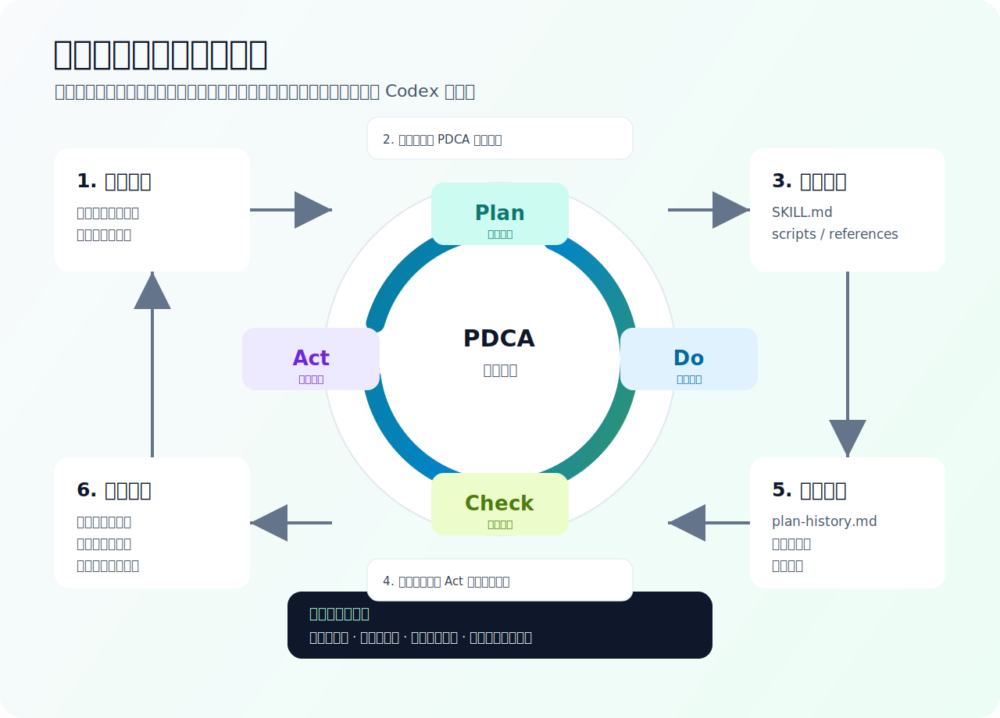

# PDCA Skill Creator

简体中文 | [English](README.md)


`pdca-skill-creator` 是一个用于创建“具备自检和自我进化能力”的 Codex 技能的元技能。

它可以把周期性业务流程、巡检任务、监控任务、报告流程、爬虫流程和运营流程，沉淀为具备执行步骤、检查规则、证据、日志、健康诊断和复盘进化能力的 Codex 技能。

## 功能介绍

`pdca-skill-creator` 不是只帮助你写一段流程说明，而是帮助你把一个业务流程沉淀成可重复执行、可检查、可复盘、可持续优化的技能。

生成出来的业务技能会围绕 PDCA 闭环设计：

- **Plan**：澄清需求、确认边界、设计执行流程和检查规则。
- **Do**：通过脚本或确定性工具执行任务，并保留日志和证据。
- **Check**：基于规则检查结果，输出异常诊断和建议动作。
- **Act**：复盘问题、吸收反馈，并决定是否进入下一轮优化。

## 核心能力

- 将模糊业务需求拆解为可执行的技能设计。
- 坚持业务核心优先，先生成最小真实业务闭环，再补齐 PDCA、报表、日志和复盘结构。
- 要求爬虫类技能生成真实采集框架，包含 URL 处理、Playwright 页面访问、基础 DOM 提取、截图、错误分类和结构化落盘。
- 为生成的技能内置 Plan / Do / Check / Act 阶段模板。
- 要求每个阶段明确输入、动作、产物、异常处理和证据要求。
- 为生成技能标注目标成熟度和当前成熟度，避免把流程说明、占位脚手架误认为已可部署系统。
- 为自动化、巡检、监控、报表和爬虫类技能生成可执行脚手架、检查器和自检入口。
- 要求生成能力矩阵，清楚标记已实现、占位和待确认能力。
- 要求 Check 脚本读取规则文件，减少检查规则写在文档里却没有被执行的风险。
- 支持生成后 smoke test，校验脚本语法、样例链路、退出码和关键产物。
- 支持生成运行日志、异常诊断表和 P0/P1/P2 优先级判断。
- 引导技能使用脚本执行任务，减少口头推断和重复 token 消耗。
- 要求截图只作为证据留档，不默认进入上下文做视觉分析。
- 要求历史日志默认只读取最新一次，避免日志堆积撑大上下文。
- 要求维护 `references/plan-history.md`，避免 Act 复盘优化时丢失历史需求。
- 要求生成的技能保留来源、版本和升级说明，方便后续用新版创建器迁移。

## 0.2.2 问题复盘与调整：业务核心优先

本轮复盘的问题：生成技能可能出现 PDCA 外壳完整，但真实业务动作仍是占位，尤其容易发生在亚马逊页面爬取、商品页巡检、网页状态采集等任务中。`0.2.2` 做了以下调整：

- **调整业务核心优先规则**：创建器必须先识别核心业务动作，并先实现最小真实闭环，再添加 PDCA、报表、日志、基准和复盘结构。
- **调整爬虫生成门槛**：网页爬取和页面巡检类技能必须生成真实采集框架，包括 URL 构造或读取、Playwright 页面访问、超时处理、基础 DOM 提取、截图、结构化输出和错误分类。
- **调整选择器处理方式**：页面选择器未知时，应生成 `references/selectors.yaml` 或等价配置文件，而不是完全跳过页面访问。
- **调整字段提取要求**：用户要求的核心字段必须标注提取策略、选择器或 fallback、证据路径和待确认项。
- **调整成熟度降级规则**：如果没有真实采集框架，当前成熟度最高只能是 L2；如果框架存在但字段选择器待确认，最高只能是 L3 可执行脚手架。
- **调整交付说明顺序**：如果业务核心仍是占位，交付说明必须优先提示该缺口，不能先强调 PDCA 外壳完整。

## 0.2.1 问题复盘与调整：生成后测试校验闭环

本轮复盘的问题：生成出来的技能容易只看“有没有脚本”，而没有检查脚本是否真的支撑当前成熟度。`0.2.1` 做了以下调整：

- **调整成熟度评级**：区分目标成熟度和当前成熟度；如果核心业务仍是 `stub`、`TODO`、`not_configured`、`dry-run only` 或占位输出，不能夸大为 L4 可部署。
- **调整能力边界表达**：要求生成技能列出目录初始化、输入校验、真实业务执行、结构化输出、报表交付、Check 规则执行、证据日志、定时入口等能力状态。
- **调整检查器生成方式**：要求 L3/L4 技能的 Check 脚本读取 `references/check-rules.yaml`、`references/output-schema.json` 或等价规则文件，而不是只把规则写在文档里。
- **调整生成后自检**：要求生成或执行 `scripts/smoke_test.py`，验证语法、最小样例链路、退出码和关键产物。
- **调整降级说明**：如果缺少账号、权限、浏览器、网络、选择器、API 密钥或外部数据，必须说明未完成自检的原因，并把当前成熟度降到证据能支撑的等级。

## 适用场景

适合用在需要长期运行、反复检查、持续优化的工作流中，例如：

- 商品页、广告页、活动页、后台页面等周期性巡检。
- 电商 Listing、ASIN、价格、库存、图片、文案等质量检查。
- 周报、日报、经营分析、运营检查表等自动化报告流程。
- 数据表格、导出文件、业务指标、异常指标的定期检查。
- 网页爬虫、DOM 抓取、截图留档和证据归档流程。
- 团队内部标准作业流程的技能化和版本化。
- 已有技能的复盘升级、检查规则增强和运行成本优化。

## 工作流



## 适合谁使用

- 希望把重复工作变成 Codex 技能的运营、产品、增长和数据团队。
- 希望让 AI 工作流具备日志、证据、检查规则和复盘机制的团队。
- 希望减少“每次都重新解释需求”的技能创建者。
- 希望让技能在多轮迭代中保留历史需求和决策原因的团队。

## 仓库结构

```text
pdca-skill-creator/
├── SKILL.md
├── agents/
│   └── openai.yaml
└── references/
    └── pdca-stage-template.md
```

- `SKILL.md`：技能入口，描述何时触发、如何创建 PDCA 技能、有哪些强制规则。
- `agents/openai.yaml`：Codex UI 中的显示名称、简短介绍和默认提示。
- `references/pdca-stage-template.md`：详细 PDCA 阶段模板，生成业务技能时按需读取。

## 安装教程

最简单的方式，是在 Codex 里把本仓库添加为插件市场。

## 发布识别信息

- 插件名称：`pdca-skill-creator`
- 插件市场：`ai-plan-go`
- 发布仓库：<https://github.com/ai-plan-go/plugins>
- Git 地址：`https://github.com/ai-plan-go/plugins.git`
- 当前版本：`0.2.2`

后续其他会话需要识别本插件时，优先查看本节、`marketplace.json` 和 `plugins/pdca-skill-creator/.codex-plugin/plugin.json`。

### 通过 Codex 插件市场安装

1. 打开 Codex。
2. 进入 **插件**。
3. 选择 **添加插件市场**。


4. 输入这个 GitHub 地址：

```text
https://github.com/ai-plan-go/plugins.git
```

5. 在插件市场里安装 **PDCA Skill Creator**。

### 手动安装兜底方式

如果你的 Codex 版本暂时不支持插件市场安装，可以手动复制技能目录：

```bash
git clone https://github.com/ai-plan-go/plugins.git
mkdir -p ~/.codex/skills
cp -R plugins/pdca-skill-creator/skills/pdca-skill-creator ~/.codex/skills/
```

### 验证安装

重启或刷新 Codex 后，可以输入：

```text
使用 $pdca-skill-creator 帮我把一个周期性工作流做成 PDCA 技能。
```

如果技能加载成功，Codex 会按 PDCA 流程追问业务目标、输入输出、检查规则和复盘要求。

## 使用方式

在 Codex 中安装或启用本技能后，可以这样使用：

```text
使用 $pdca-skill-creator 帮我把每日商品页巡检流程做成一个可以自检、复盘和持续优化的技能。
```

生成业务技能时，创建器会引导确认：

- 业务目标是什么。
- 输入数据来自哪里。
- 输出给谁使用。
- 如何判断成功或失败。
- 哪些异常需要诊断。
- 是否需要脚本、日志、截图、报告或历史记录。
- 后续如何通过 Act 阶段继续优化。

## 生成技能的保障机制

使用 `pdca-skill-creator` 生成的技能会尽量包含：

- 清晰的 PDCA 运行模型。
- 明确的输入、动作、产物、异常处理和证据要求。
- 面向重复任务的脚本优先执行方式。
- 结构化日志和检查结果。
- 带 P0/P1/P2 优先级的健康诊断。
- 针对脚本、截图和历史日志的 token 控制规则。
- 用于保留历史需求和决策原因的 `references/plan-history.md`。
- 记录创建器名称、仓库、版本和生成日期的来源信息。

## 设计理念

目标不是让 AI 每次都“重新思考得更多”，而是让重复工作更结构化：

- 稳定部分交给脚本执行。
- 检查规则负责判断结果。
- 日志和证据让结论可复核。
- Act 阶段复盘保留经验。
- 历史 Plan 记录避免需求在迭代中漂移。

## 版本

当前创建器版本：`0.2.2`

来源仓库：<https://github.com/ai-plan-go/plugins.git>
