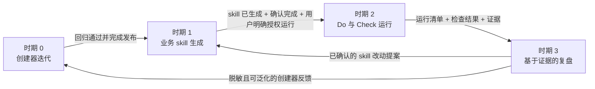
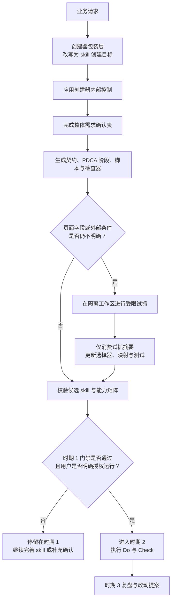
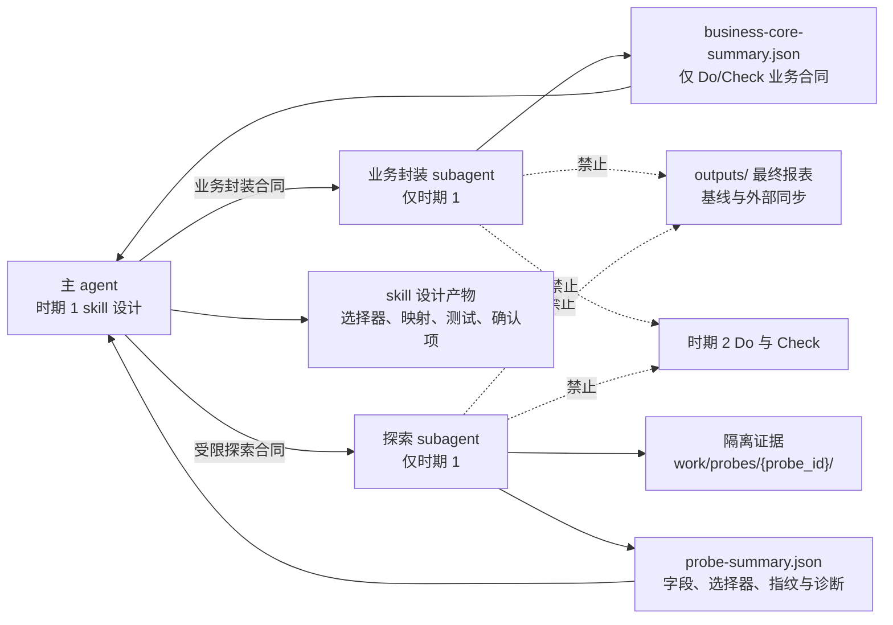

# PDCA Skill Creator

简体中文 | [English](README.md)


`pdca-skill-creator` 是一个用于创建“具备自检和自我进化能力”的 Codex 技能的元技能。

它可以把周期性业务流程、巡检任务、监控任务、报告流程、爬虫流程和运营流程，沉淀为具备执行步骤、检查规则、证据、日志、健康诊断和复盘进化能力的 Codex 技能。

## 功能介绍

`pdca-skill-creator` 不是只帮助你写一段流程说明，而是帮助你把一个业务流程沉淀成可重复执行、可检查、可复盘、可持续优化的技能。

生成出来的业务技能会围绕 PDCA 闭环设计：

- **Plan**：澄清需求、确认边界、设计执行流程和检查规则。
- **Do**：通过脚本或确定性工具执行任务，并保留日志和证据。
- **Check**：基于规则检查结果，输出异常诊断和建议动作。
- **Act**：复盘问题、吸收反馈，并决定是否进入下一轮优化。

## 核心能力

### 业务核心优先

- 将模糊需求拆成业务目标、输入输出、检查规则和执行边界。
- 先识别核心业务动作，再补 PDCA、报表、日志、基准和复盘结构。
- 对网页巡检、爬虫和页面状态采集任务，要求生成真实采集路径：URL、Playwright 访问、DOM 提取、截图、结构化结果和错误分类。
- 页面选择器未知时生成 `references/selectors.yaml`，并要求脚本真实读取。

### PDCA 可执行脚手架

- 生成业务化 Plan、Do、Check、Act 阶段，包含输入、动作、产物、异常处理、证据和确认点。
- 创建自动化、爬虫、巡检、报表或定时技能前，必须生成步骤检查确认表，逐项确认参数、状态、风险和处理动作。
- 为自动化、巡检、监控、报表、爬虫和周期性运营动作生成最小可执行脚手架。
- 标准脚本包括 `init_project.py`、`run_task.py`、`check_outputs.py`、`smoke_test.py`，以及按需定时入口。
- 对 L3/L4 可执行技能，必须生成 `references/do-run-plan.md`，让用户无需阅读源码也能理解 Do 脚本流程。
- 鼓励脚本优先，减少重复口头推断和上下文消耗。

### 成熟度与证据化声明

- 区分目标成熟度和当前成熟度，避免把占位脚手架误认为生产系统。
- 生成能力矩阵和业务核心实现矩阵，标注已实现、占位、待确认、证据和缺口。
- 要求 Check 脚本读取规则文件和输出 schema。
- 要求规则文件、schema、Do 输出、Check 字段和部署契约保持一致。

成熟度分为四级：

| 等级 | 含义 | 典型证据 |
|---|---|---|
| L1 规范型 | 业务流程、规则和待确认项已整理，但不能宣称可运行 | PDCA 阶段、业务规则、待确认清单 |
| L2 规则型 | 有规则、部署契约和输出格式，但缺少稳定执行脚本 | 检查规则、输出 schema、部署契约 |
| L3 可执行型 | 有 Do/Check 脚本、结构化输出、日志和本地运行入口 | `run_task.py`、`check_outputs.py`、smoke test、运行日志 |
| L4 可部署型 | 在 L3 基础上具备真实业务执行路径、定时入口、失败处理和部署验收记录 | 定时入口、退出码、日志定位、部署参数、验收记录 |

### 质量门禁与评分

- 保留 `scripts/run_creator_use_case_test.py`，用默认亚马逊 ASIN 用例做创建器回归测试。
- 新增秀动后摇回归用例，覆盖安装验证、运行时选择、字段质量、分类证据和网络诊断。
- 新增 `scripts/run_generated_skill_quality_gate.py`，用于不绑定业务关键词的通用规范评分。
- 要求新生成的技能自带 `scripts/score_skill_quality.py` 和 `references/skill-quality-rubric.json`，用于通用规范验收。
- 要求新生成的技能自带 `scripts/run_business_use_case_test.py` 和 `references/business-use-case-profile.json`，用于当前业务专属验收。
- 默认通过线为 85 分，且不能存在 P0/P1 阻断项。

### 自我优化与复测

- 区分“自我优化机制”“自我优化可执行”“自我进化有效性”。
- Act 产物必须写出复测入口和复测证据路径。
- 未运行复测时必须标为“待确认”或“未验证”，不能暗示已经成功。
- 用 `references/plan-history.md` 保留历史需求、决策和改进原因。

### 插件交付与清洁发布

- 用户要求插件或 Codex 可安装产物时，默认生成 `.codex-plugin/plugin.json` 和 `skills/` 目录。
- 要求安装、重装、已安装缓存同步、结构检查和至少一次安装后 dry-run 都有可验证说明。
- Windows 定时入口必须允许显式指定 Python 运行时，不能假设裸 `python` 可用。
- 爬虫和分类技能的 smoke test 必须校验样例字段与业务分类结果，而不只是文件是否存在。
- 对网络权限、超时、HTTP、登录或验证码、选择器和代理等采集失败分类诊断，并给出复跑建议。
- zip 只能作为附加传输包，不能替代可安装插件目录。
- 成品目录不得包含 `__pycache__/`、`*.pyc`、`work_smoke/`、`tmp_smoke/`、业务测试报告、临时日志和本地测试输出。
- 测试脚本支持普通技能目录和可安装插件根目录，并在报告中标明候选类型。

## 固定创建流程

每次新建或升级技能都按以下具名步骤执行：

1. **Step 1 - 需求检查确认**：记录业务目标、数据源、范围、字段、输出、环境、质量规则和交付形态。
2. **Step 2 - 创建器包装**：把业务请求改写为创建技能的目标，不能当作立即执行业务的命令。
3. **Step 3 - 业务核心收敛**：先定义最小可执行的核心业务动作，再补报表、日志、PDCA 结构和插件包装。
4. **Step 4 - 试抓或业务封装**：仅在字段、页面限制或业务契约未确认时，使用受限试抓或 subagent。
5. **Step 5 - 技能结构生成**：生成技能或可安装插件目录。
6. **Step 6 - 契约与脚本补齐**：补齐运行计划、脚本设计、AI 决策检查单、规则、schema 和可运行脚手架。
7. **Step 7 - 质量门禁与自检**：拒绝跳过确认、缺少业务核心、泄漏创建器内部控制或夸大运行能力的交付。
8. **Step 8 - 发布与交付**：检查元数据、包结构和交付目录清洁度。

其中两个门禁不可绕过：需求确认先于实现和试抓；设计已确认不等于已获准真实执行 Do/Check。`active_period` 是创建器内部控制状态，生成业务技能的使用者无需理解它。

## 创建器内部控制

本节是面向维护者的创建器内部控制地图。`SKILL.md` 与其引用的契约仍是机器执行时的权威规则。生成出来的业务技能应使用准备、运行和复盘等表达，不向业务使用者暴露 `active_period` 或时期编号。

### 四时期生命周期



| 时期 | 处理对象与允许动作 | 必须证据 | 硬边界 | 退出条件 |
|---|---|---|---|---|
| 0 | 更新创建器本身：规则、模板、门禁、回归用例、版本和发布包。 | 变更记录、回归结果、发布同步证据。 | 不创建或伪造业务运行数据。 | 创建器回归通过，发布文件完成同步。 |
| 1 | 新建或升级业务 skill：澄清需求、定义契约、生成脚手架、建立测试基线。 | 创建器包装结果、确认表、生命周期契约、能力矩阵。 | 不得声称最终业务结果，不得进入真实 Do/Check。 | skill 已生成、所有 P0/P1 确认项已解决、用户明确授权运行。 |
| 2 | 在独立运行目录中执行已有 skill 的 Do 与 Check。 | `run-manifest.json`、日志、结构化结果、Check 结果、证据路径、退出码。 | 运行中不得修改 skill 源码、规则或基线。 | 已形成可供复盘的完整运行记录。 |
| 3 | 围绕一个明确运行记录复盘并形成改动提案。 | 运行证据、诊断、提案、影响分析和复测计划。 | 不得静默实施或发布提案。 | 用户确认返回时期 1，或将提案保留为反馈。 |

### 主流程与门禁顺序



在创建 skill 的过程中，“开始”“继续”“执行”等词默认解释为继续完善 skill。只有用户明确授权真实 Do/Check 或正式采集时，才允许进入真实运行。

### 控制检查单对照

| 控制点 | 时期 | 必须检查什么 | 证据或产物 | 不通过时如何处理 |
|---|---:|---|---|---|
| 创建器包装层 | 1 | 业务请求是否已改写为可复用 skill 能力，而不是立即执行业务命令。 | 原始目标、skill 目标、禁止直接动作、允许样例边界。 | 在搜索、采集、脚本执行和最终报表生成之前停止。 |
| 整体需求确认 | 1 | 数据源、输出格式、触发方式、参数、权限与交付形态是否已确认或标为待确认。 | 含状态、风险和处理动作的完整确认表。 | 保持设计状态，不得宣称可部署。 |
| 时期切换门禁 | 1 -> 2 | skill 是否存在、是否不存在 P0/P1 待确认项、用户是否明确授权真实运行。 | 生命周期契约和明确用户授权。 | 即使已能访问页面，也仍停留在时期 1。 |
| Do 设计 | 1 | 业务核心是否先于报表和流程外壳形成真实执行路径。 | `do-run-plan.md`、`script-design.md`、AI 决策检查单、脚本清单。 | 降级成熟度或记录实现缺口。 |
| 运行溯源 | 2 | 每个业务结果是否可追溯到来源、脚本版本、处理步骤、记录数、证据和退出码。 | `run-manifest.json` 或等价清单。 | 标为未验证，阻断基线更新、外部同步和业务结论。 |
| Check 强制执行 | 2 | 检查脚本是否读取规则和 schema、验证必需产物并分类失败。 | 机器可读 Check 结果、规则、schema、退出码。 | 输出 P0/P1/P2 诊断并进入复盘。 |
| 复盘提案 | 3 | 提案是否列明证据、范围、风险、用户决策和复测入口。 | 改动提案与复测计划。 | 在回到时期 1 前不得修改源码或发布。 |
| 发布同步 | 0 | 已发布规则、模板、脚本、元数据和说明文档是否一致。 | 回归输出、版本匹配、发布提交。 | 未修正不一致前阻断发布。 |

### Subagent 隔离

探索 subagent 只能用于解决明确的不确定性，例如页面结构、字段映射、选择器候选、登录限制或小范围外部协议问题。它绝不是绕过主流程进入真实业务执行的捷径。



| 角色 | 可以访问或创建 | 必须禁止 |
|---|---|---|
| 主 agent | 时期控制、确认表、skill 源码、契约、选择器、测试和结构化试抓摘要。 | 将原始试抓数据当作最终业务产物，或用试抓成功作为运行授权。 |
| 业务封装 subagent | 受限业务问题和 `business-core-summary.json`，其中包含 Do 核心动作、输入输出、Check 规则、异常、证据、开放决策和覆盖缺口。 | 访问真实全量业务数据、运行 Do/Check、生成最终报表、更新基线、外部同步、发布或授权进入时期 2。 |
| 探索 subagent | 命名的问题、受限样本、`work/probes/{probe_id}/` 和 `probe-summary.json`。 | 批量采集、最终表格、基线更新、外部同步、skill 发布或时期 2 Do/Check。 |
| 审核 subagent | 边界合同、候选 skill 产物和摘要级证据。 | 除非出现明确诊断需要，否则读取原始业务样本。 |

每份探索合同都必须记录问题、允许来源、样本上限、隔离目录、禁止动作、摘要 schema 和停止条件。默认上限为 3 个页面或 10 个页面元素。主 agent 只能消费结构化摘要与证据索引，再将其转化为选择器、字段映射、测试样例或待确认问题。

业务封装在页面探索之前也遵循同一原则：`references/business-core-boundary.md` 将 subagent 输入限制为需求和已确认规则，`business-core-summary.json` 只允许包含拟定的 Do/Check 业务合同。主 agent 必须将其与确认表二次核对，再转写为业务核心实现计划、Do 计划、脚本设计、Check 规则、输出 schema 和 AI 决策检查单。两类摘要都不能授权进入时期 2。

### 交付检查单

| 时期 1 skill 交付前 | 时期 2 运行被接受前 | 创建器版本发布前 |
|---|---|---|
| 已明确创建器包装结果和 active period。 | 已确认运行参数并分配唯一 `run_id`。 | `SKILL.md`、模板、检查器、元数据和 README 版本声明一致。 |
| 确认表已列出所有未解决 P0/P1 项。 | Do 已写入结构化结果、日志、证据和溯源清单。 | 创建器回归和隔离检查通过。 |
| PDCA 已写清输入、动作、产物、异常、证据和用户决策。 | Check 已读取规则与 schema，输出机器可读结果和退出码。 | 未暂存缓存、临时日志、smoke 目录或本地测试输出。 |
| L3/L4 候选已有 Do 计划、脚本设计、AI 决策检查单、规则、schema 与 smoke 路径。 | 已诊断环境、权限、HTTP、登录/验证码、选择器、代理或未知采集异常。 | 发布提交只包含预期文件和干净的版本包。 |
| 任何试抓都使用 `references/subagent-boundary.md`，原始证据不写入最终输出。 | 运行失败进入时期 3 作为证据，而不是静默修改源码。 | 推送后已核对远端分支与发布提交。 |

### 优先级模型

| 优先级 | 含义 | 典型控制失败 |
|---|---|---|
| P0 | 阻断：结果不可用、不安全，或已跨越生命周期边界。 | 时期 1 产出最终业务报表；subagent 写入最终输出；业务核心缺失。 |
| P1 | 影响正确性或稳定性的实质风险。 | 规则或选择器未被消费；试抓没有边界合同；成熟度被夸大。 |
| P2 | 低风险优化或文档体验缺口。 | 说明可以更清楚、报告排版可优化、可选辅助示例缺失。 |

完整机器执行规则请参阅 [`SKILL.md`](plugins/pdca-skill-creator/skills/pdca-skill-creator/SKILL.md)、[生命周期协议](plugins/pdca-skill-creator/skills/pdca-skill-creator/references/lifecycle-protocol.md) 和 [subagent 隔离协议](plugins/pdca-skill-creator/skills/pdca-skill-creator/references/subagent-isolation-protocol.md)。

## 版本摘要

| 版本 | 主要变化 |
|---|---|
| 0.2.29 | 隔离创建器流程记录和业务入口 `SKILL.md`：确认表、包装层、成熟度审计迁移到 `references/`，质量门禁会拦截业务入口泄漏创建器步骤。 |
| 0.2.28 | 文档同步固定的八步创建流程、强制需求确认、业务核心优先和仅创建器内部使用的 `active_period`。 |
| 0.2.27 | 用具名步骤和硬触发器替换重复说明，并从机器执行的 `SKILL.md` 移除发布元信息。 |
| 0.2.26 | 新增具名的需求检查确认步骤，并避免向生成业务技能泄漏 `active_period`。 |
| 0.2.24 | 新增业务封装 subagent 合同：将 Do/Check 的业务设计隔离为结构化摘要，再由主 agent 审查并转写为技能契约，全程不触碰真实业务执行。 |
| 0.2.23 | 新增时期 1 的受限 subagent 隔离合同：原始试抓样本仅保留在隔离证据目录，主流程只消费结构化摘要，试抓成功不构成进入运行期或产出最终业务结果的授权。 |
| 0.2.22 | 将 Playwright-first 约束扩展到时期 1 的站点摸底和字段映射试抓，并要求 Codex 沙箱阻止浏览器启动时生成 Windows 宿主 PowerShell 复跑路径。 |
| 0.2.21 | 强化 Playwright-first 爬虫脚手架门禁，禁止把纯 HTTP 客户端当作网页主采集链路，补充升级发布同步说明，并明确最外层 `README.md` 与 `README.zh-CN.md` 必须随版本同步。 |
| 0.2.20 | 将 `script-design.md` 和 `ai-decision-checklist.md` 升级为 L3/L4 技能强制产物，新增质量门禁校验，并修复发布文档版本不同步问题。 |
| 0.2.19 | 新增执行术语消歧门禁，确认完成后像“开始执行”这类回复默认仍停留在时期 1，除非用户明确授权进入运行期。 |
| 0.2.18 | 新增创建器包装层门禁，先把传入创建器的业务需求转换为技能创建目标，再允许进入后续生成流程。 |
| 0.2.17 | 新增创建器时期强制门禁、强制进度提示契约，并对齐发布包版本信息。 |
| 0.2.16 | 业务数据仅允许脚本生成，新增来源-处理-结果运行清单与基线/同步阻断校验。 |
| 0.2.15 | 确认表升级为必须整体确认的预检门，新增爬虫范围、试抓字段映射和脚本与 AI 决策分析。 |
| 0.2.14 | ShowStart 回归改为首页列表多条采集、去重、详情补充上限和批量同步计划检查。 |
| 0.2.13 | 新增时期 0-3 生命周期隔离，分开创建器迭代、业务技能生成、运行检查和基于证据的复盘提案。 |
| 0.2.12 | 新增安装后验证、可配置 Python 运行入口、样例驱动的爬虫分类测试、细分网络诊断、秀动后摇回归用例和更严格的交付清理。 |
| 0.2.11 | 明确 README 面向人，偏宣传和使用指南；SKILL.md 面向 AI，承载流程控制和模板规则。 |
| 0.2.10 | 明确 README 分工、项目结构说明和版本同步规则，避免市场页、插件包说明和技能规则漂移。 |
| 0.2.9 | 新增 Do 脚本流程计划文档要求，避免生成插件的运行脚本成为黑盒。 |
| 0.2.8 | 新增步骤检查确认表门禁，要求逐项确认参数、状态、风险和处理动作后再生成自动化技能。 |
| 0.2.7 | 强化自动化任务生成前确认、Codex 安排任务识别、可安装插件门禁和 smoke 写入边界检查。 |
| 0.2.6 | 拆分通用规范评分和业务用例评分，新增生成技能双层质量门禁。 |
| 0.2.5 | 强化自我优化能力分层、复测证据路径、插件形态测试识别和清洁发布。 |
| 0.2.4 | 新增创建器用例测试闭环、默认亚马逊 ASIN 回归用例和确定性测试脚本。 |
| 0.2.3 | 强化可安装插件交付、输出契约一致性、选择器消费和 smoke test 判错。 |
| 0.2.2 | 强化业务核心优先和爬虫类真实采集框架，避免 PDCA 外壳挤掉核心业务。 |
| 0.2.1 | 建立成熟度分级、能力边界、检查器生成和生成后自检要求。 |

## 适用场景

适合用在需要长期运行、反复检查、持续优化的工作流中，例如：

- 商品页、广告页、活动页、后台页面等周期性巡检。
- 电商 Listing、ASIN、价格、库存、图片、文案等质量检查。
- 周报、日报、经营分析、运营检查表等自动化报告流程。
- 数据表格、导出文件、业务指标、异常指标的定期检查。
- 网页爬虫、DOM 抓取、截图留档和证据归档流程。
- 团队内部标准作业流程的技能化和版本化。
- 已有技能的复盘升级、检查规则增强和运行成本优化。

## 工作流


## 适合谁使用

- 希望把重复工作变成 Codex 技能的运营、产品、增长和数据团队。
- 希望让 AI 工作流具备日志、证据、检查规则和复盘机制的团队。
- 希望减少“每次都重新解释需求”的技能创建者。
- 希望让技能在多轮迭代中保留历史需求和决策原因的团队。

## 仓库结构

```text
plugins-repo/
├── README.md
├── README.zh-CN.md
├── marketplace.json
├── assets/
└── plugins/
    └── pdca-skill-creator/
        ├── .codex-plugin/
        │   └── plugin.json
        ├── assets/
        ├── docs/
        │   └── repository-structure.md
        └── skills/
            └── pdca-skill-creator/
                ├── SKILL.md
                ├── agents/
                │   └── openai.yaml
                ├── references/
                └── scripts/
```

- 最外层 `README.md` / `README.zh-CN.md`：面向人的仓库入口说明和版本摘要。
- `plugins/pdca-skill-creator/skills/pdca-skill-creator/SKILL.md`：面向 AI 的权威技能规则与创建流程。
- `plugins/pdca-skill-creator/skills/pdca-skill-creator/agents/openai.yaml`：Codex UI 元信息。
- `plugins/pdca-skill-creator/skills/pdca-skill-creator/references/pdca-stage-template.md`：生成业务技能时读取的详细 PDCA 阶段模板。

## 安装教程

最简单的方式，是在 Codex 里把本仓库添加为插件市场。

## 发布识别信息

- 插件名称：`pdca-skill-creator`
- 插件市场：`ai-plan-go`
- 发布仓库：<https://github.com/ai-plan-go/plugins>
- Git 地址：`https://github.com/ai-plan-go/plugins.git`
- 当前版本：`0.2.29`

## 升级发布同步说明

升级 `pdca-skill-creator` 时，最外层 `README.md` 和 `README.zh-CN.md` 必须与以下文件同步：

- `plugins/pdca-skill-creator/skills/pdca-skill-creator/SKILL.md`
- `plugins/pdca-skill-creator/.codex-plugin/plugin.json`
- `plugins/pdca-skill-creator/docs/repository-structure.md`

除非先明确修改结构说明文件，否则不要再在插件目录下额外复制新的 README。

后续其他会话需要识别本插件时，优先查看本节、`marketplace.json` 和 `plugins/pdca-skill-creator/.codex-plugin/plugin.json`。

### 通过 Codex 插件市场安装

1. 打开 Codex。
2. 进入 **插件**。
3. 选择 **添加插件市场**。


4. 输入这个 GitHub 地址：

```text
https://github.com/ai-plan-go/plugins.git
```

5. 在插件市场里安装 **PDCA Skill Creator**。

### 手动安装兜底方式

如果你的 Codex 版本暂时不支持插件市场安装，可以手动复制技能目录：

```bash
git clone https://github.com/ai-plan-go/plugins.git
mkdir -p ~/.codex/skills
cp -R plugins/pdca-skill-creator/skills/pdca-skill-creator ~/.codex/skills/
```

### 验证安装

重启或刷新 Codex 后，可以输入：

```text
使用 $pdca-skill-creator 帮我把一个周期性工作流做成 PDCA 技能。
```

如果技能加载成功，Codex 会按 PDCA 流程追问业务目标、输入输出、检查规则和复盘要求。

## 使用方式

在 Codex 中安装或启用本技能后，可以这样使用：

```text
使用 $pdca-skill-creator 帮我把每日商品页巡检流程做成一个可以自检、复盘和持续优化的技能。
```

生成业务技能时，创建器会引导确认：

- 业务目标是什么。
- 输入数据来自哪里。
- 数据来源、输出格式、触发方案、运行参数和交付形态是什么。
- 输出给谁使用。
- 如何判断成功或失败。
- 哪些异常需要诊断。
- 是否需要脚本、日志、截图、报告或历史记录。
- 后续如何通过 Act 阶段继续优化。

## 生成技能的保障机制

使用 `pdca-skill-creator` 生成的技能会尽量包含：

- 清晰的 PDCA 运行模型。
- 明确的输入、动作、产物、异常处理和证据要求。
- 面向重复任务的脚本优先执行方式。
- 面向自动化任务的步骤检查确认表。
- 面向可执行 Do 脚本的 `references/do-run-plan.md` 流程计划文档。
- 结构化日志和检查结果。
- 带 P0/P1/P2 优先级的健康诊断。
- 针对脚本、截图和历史日志的 token 控制规则。
- 用于保留历史需求和决策原因的 `references/plan-history.md`。
- 在需要时保留来源溯源信息，但不向业务使用者暴露创建器内部控制字段。

## 设计理念

目标不是让 AI 每次都“重新思考得更多”，而是让重复工作更结构化：

- 稳定部分交给脚本执行。
- 检查规则负责判断结果。
- 日志和证据让结论可复核。
- Act 阶段复盘保留经验。
- 历史 Plan 记录避免需求在迭代中漂移。

## 版本

当前创建器版本：`0.2.29`

来源仓库：<https://github.com/ai-plan-go/plugins.git>
