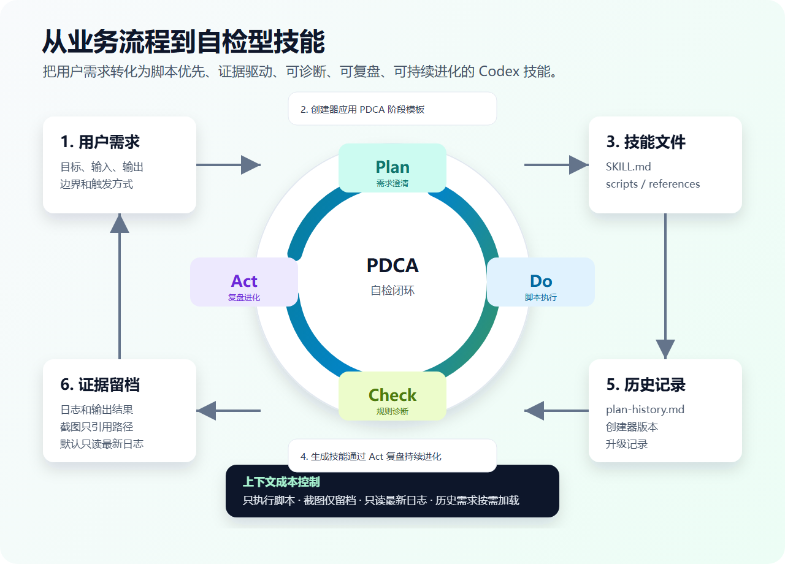
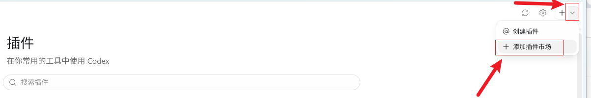

# PDCA Skill Creator

简体中文 | [English](README.md)


`pdca-skill-creator` 是一个用于创建“具备自检和自我进化能力”的 Codex 技能的元技能。

它可以把周期性业务流程、巡检任务、监控任务、报告流程、爬虫流程和运营流程，沉淀为具备执行步骤、检查规则、证据、日志、健康诊断和复盘进化能力的 Codex 技能。

## 功能介绍

`pdca-skill-creator` 不是只帮助你写一段流程说明，而是帮助你把一个业务流程沉淀成可重复执行、可检查、可复盘、可持续优化的技能。

生成出来的业务技能会围绕 PDCA 闭环设计：

- **Plan**：澄清需求、确认边界、设计执行流程和检查规则。
- **Do**：通过脚本或确定性工具执行任务，并保留日志和证据。
- **Check**：基于规则检查结果，输出异常诊断和建议动作。
- **Act**：复盘问题、吸收反馈，并决定是否进入下一轮优化。

## 核心能力

### 业务核心优先

- 将模糊需求拆成业务目标、输入输出、检查规则和执行边界。
- 先识别核心业务动作，再补 PDCA、报表、日志、基准和复盘结构。
- 对网页巡检、爬虫和页面状态采集任务，要求生成真实采集路径：URL、Playwright 访问、DOM 提取、截图、结构化结果和错误分类。
- 页面选择器未知时生成 `references/selectors.yaml`，并要求脚本真实读取。

### PDCA 可执行脚手架

- 生成业务化 Plan、Do、Check、Act 阶段，包含输入、动作、产物、异常处理、证据和确认点。
- 创建自动化、爬虫、巡检、报表或定时技能前，必须生成步骤检查确认表，逐项确认参数、状态、风险和处理动作。
- 为自动化、巡检、监控、报表、爬虫和周期性运营动作生成最小可执行脚手架。
- 标准脚本包括 `init_project.py`、`run_task.py`、`check_outputs.py`、`smoke_test.py`，以及按需定时入口。
- 对 L3/L4 可执行技能，必须生成 `references/do-run-plan.md`，让用户无需阅读源码也能理解 Do 脚本流程。
- 鼓励脚本优先，减少重复口头推断和上下文消耗。

### 成熟度与证据化声明

- 区分目标成熟度和当前成熟度，避免把占位脚手架误认为生产系统。
- 生成能力矩阵和业务核心实现矩阵，标注已实现、占位、待确认、证据和缺口。
- 要求 Check 脚本读取规则文件和输出 schema。
- 要求规则文件、schema、Do 输出、Check 字段和部署契约保持一致。

成熟度分为四级：

| 等级 | 含义 | 典型证据 |
|---|---|---|
| L1 规范型 | 业务流程、规则和待确认项已整理，但不能宣称可运行 | PDCA 阶段、业务规则、待确认清单 |
| L2 规则型 | 有规则、部署契约和输出格式，但缺少稳定执行脚本 | 检查规则、输出 schema、部署契约 |
| L3 可执行型 | 有 Do/Check 脚本、结构化输出、日志和本地运行入口 | `run_task.py`、`check_outputs.py`、smoke test、运行日志 |
| L4 可部署型 | 在 L3 基础上具备真实业务执行路径、定时入口、失败处理和部署验收记录 | 定时入口、退出码、日志定位、部署参数、验收记录 |

### 质量门禁与评分

- 保留 `scripts/run_creator_use_case_test.py`，用默认亚马逊 ASIN 用例做创建器回归测试。
- 新增秀动后摇回归用例，覆盖安装验证、运行时选择、字段质量、分类证据和网络诊断。
- 新增 `scripts/run_generated_skill_quality_gate.py`，用于不绑定业务关键词的通用规范评分。
- 要求新生成的技能自带 `scripts/score_skill_quality.py` 和 `references/skill-quality-rubric.json`，用于通用规范验收。
- 要求新生成的技能自带 `scripts/run_business_use_case_test.py` 和 `references/business-use-case-profile.json`，用于当前业务专属验收。
- 默认通过线为 85 分，且不能存在 P0/P1 阻断项。

### 自我优化与复测

- 区分“自我优化机制”“自我优化可执行”“自我进化有效性”。
- Act 产物必须写出复测入口和复测证据路径。
- 未运行复测时必须标为“待确认”或“未验证”，不能暗示已经成功。
- 用 `references/plan-history.md` 保留历史需求、决策和改进原因。

### 插件交付与清洁发布

- 用户要求插件或 Codex 可安装产物时，默认生成 `.codex-plugin/plugin.json` 和 `skills/` 目录。
- 要求安装、重装、已安装缓存同步、结构检查和至少一次安装后 dry-run 都有可验证说明。
- Windows 定时入口必须允许显式指定 Python 运行时，不能假设裸 `python` 可用。
- 爬虫和分类技能的 smoke test 必须校验样例字段与业务分类结果，而不只是文件是否存在。
- 对网络权限、超时、HTTP、登录或验证码、选择器和代理等采集失败分类诊断，并给出复跑建议。
- zip 只能作为附加传输包，不能替代可安装插件目录。
- 成品目录不得包含 `__pycache__/`、`*.pyc`、`work_smoke/`、`tmp_smoke/`、业务测试报告、临时日志和本地测试输出。
- 测试脚本支持普通技能目录和可安装插件根目录，并在报告中标明候选类型。

## 版本摘要

| 版本 | 主要变化 |
|---|---|
| 0.2.16 | 业务数据仅允许脚本生成，新增来源-处理-结果运行清单与基线/同步阻断校验。 |
| 0.2.15 | 确认表升级为必须整体确认的预检门，新增爬虫范围、试抓字段映射和脚本与 AI 决策分析。 |
| 0.2.14 | ShowStart 回归改为首页列表多条采集、去重、详情补充上限和批量同步计划检查。 |
| 0.2.13 | 新增时期 0-3 生命周期隔离，分开创建器迭代、业务技能生成、运行检查和基于证据的复盘提案。 |
| 0.2.12 | 新增安装后验证、可配置 Python 运行入口、样例驱动的爬虫分类测试、细分网络诊断、秀动后摇回归用例和更严格的交付清理。 |
| 0.2.11 | 明确 README 面向人，偏宣传和使用指南；SKILL.md 面向 AI，承载流程控制和模板规则。 |
| 0.2.10 | 明确 README 分工、项目结构说明和版本同步规则，避免市场页、插件包说明和技能规则漂移。 |
| 0.2.9 | 新增 Do 脚本流程计划文档要求，避免生成插件的运行脚本成为黑盒。 |
| 0.2.8 | 新增步骤检查确认表门禁，要求逐项确认参数、状态、风险和处理动作后再生成自动化技能。 |
| 0.2.7 | 强化自动化任务生成前确认、Codex 安排任务识别、可安装插件门禁和 smoke 写入边界检查。 |
| 0.2.6 | 拆分通用规范评分和业务用例评分，新增生成技能双层质量门禁。 |
| 0.2.5 | 强化自我优化能力分层、复测证据路径、插件形态测试识别和清洁发布。 |
| 0.2.4 | 新增创建器用例测试闭环、默认亚马逊 ASIN 回归用例和确定性测试脚本。 |
| 0.2.3 | 强化可安装插件交付、输出契约一致性、选择器消费和 smoke test 判错。 |
| 0.2.2 | 强化业务核心优先和爬虫类真实采集框架，避免 PDCA 外壳挤掉核心业务。 |
| 0.2.1 | 建立成熟度分级、能力边界、检查器生成和生成后自检要求。 |

## 适用场景

适合用在需要长期运行、反复检查、持续优化的工作流中，例如：

- 商品页、广告页、活动页、后台页面等周期性巡检。
- 电商 Listing、ASIN、价格、库存、图片、文案等质量检查。
- 周报、日报、经营分析、运营检查表等自动化报告流程。
- 数据表格、导出文件、业务指标、异常指标的定期检查。
- 网页爬虫、DOM 抓取、截图留档和证据归档流程。
- 团队内部标准作业流程的技能化和版本化。
- 已有技能的复盘升级、检查规则增强和运行成本优化。

## 工作流



## 适合谁使用

- 希望把重复工作变成 Codex 技能的运营、产品、增长和数据团队。
- 希望让 AI 工作流具备日志、证据、检查规则和复盘机制的团队。
- 希望减少“每次都重新解释需求”的技能创建者。
- 希望让技能在多轮迭代中保留历史需求和决策原因的团队。

## 仓库结构

```text
pdca-skill-creator/
├── SKILL.md
├── agents/
│   └── openai.yaml
└── references/
    └── pdca-stage-template.md
```

- `SKILL.md`：技能入口，描述何时触发、如何创建 PDCA 技能、有哪些强制规则。
- `agents/openai.yaml`：Codex UI 中的显示名称、简短介绍和默认提示。
- `references/pdca-stage-template.md`：详细 PDCA 阶段模板，生成业务技能时按需读取。

## 安装教程

最简单的方式，是在 Codex 里把本仓库添加为插件市场。

## 发布识别信息

- 插件名称：`pdca-skill-creator`
- 插件市场：`ai-plan-go`
- 发布仓库：<https://github.com/ai-plan-go/plugins>
- Git 地址：`https://github.com/ai-plan-go/plugins.git`
- 当前版本：`0.2.16`

后续其他会话需要识别本插件时，优先查看本节、`marketplace.json` 和 `plugins/pdca-skill-creator/.codex-plugin/plugin.json`。

### 通过 Codex 插件市场安装

1. 打开 Codex。
2. 进入 **插件**。
3. 选择 **添加插件市场**。



4. 输入这个 GitHub 地址：

```text
https://github.com/ai-plan-go/plugins.git
```

5. 在插件市场里安装 **PDCA Skill Creator**。

### 手动安装兜底方式

如果你的 Codex 版本暂时不支持插件市场安装，可以手动复制技能目录：

```bash
git clone https://github.com/ai-plan-go/plugins.git
mkdir -p ~/.codex/skills
cp -R plugins/pdca-skill-creator/skills/pdca-skill-creator ~/.codex/skills/
```

### 验证安装

重启或刷新 Codex 后，可以输入：

```text
使用 $pdca-skill-creator 帮我把一个周期性工作流做成 PDCA 技能。
```

如果技能加载成功，Codex 会按 PDCA 流程追问业务目标、输入输出、检查规则和复盘要求。

## 使用方式

在 Codex 中安装或启用本技能后，可以这样使用：

```text
使用 $pdca-skill-creator 帮我把每日商品页巡检流程做成一个可以自检、复盘和持续优化的技能。
```

生成业务技能时，创建器会引导确认：

- 业务目标是什么。
- 输入数据来自哪里。
- 数据来源、输出格式、触发方案、运行参数和交付形态是什么。
- 输出给谁使用。
- 如何判断成功或失败。
- 哪些异常需要诊断。
- 是否需要脚本、日志、截图、报告或历史记录。
- 后续如何通过 Act 阶段继续优化。

## 生成技能的保障机制

使用 `pdca-skill-creator` 生成的技能会尽量包含：

- 清晰的 PDCA 运行模型。
- 明确的输入、动作、产物、异常处理和证据要求。
- 面向重复任务的脚本优先执行方式。
- 面向自动化任务的步骤检查确认表。
- 面向可执行 Do 脚本的 `references/do-run-plan.md` 流程计划文档。
- 结构化日志和检查结果。
- 带 P0/P1/P2 优先级的健康诊断。
- 针对脚本、截图和历史日志的 token 控制规则。
- 用于保留历史需求和决策原因的 `references/plan-history.md`。
- 记录创建器名称、仓库、版本和生成日期的来源信息。

## 设计理念

目标不是让 AI 每次都“重新思考得更多”，而是让重复工作更结构化：

- 稳定部分交给脚本执行。
- 检查规则负责判断结果。
- 日志和证据让结论可复核。
- Act 阶段复盘保留经验。
- 历史 Plan 记录避免需求在迭代中漂移。

## 版本

当前创建器版本：`0.2.16`

来源仓库：<https://github.com/ai-plan-go/plugins.git>

